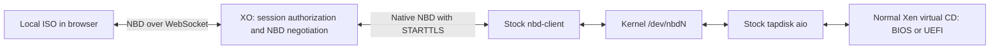

# Browser ISO spike: stock nbd-client on XCP-ng

## Result

The native NBD approach works on the XCP-ng 8.3 test host. A real browser File supplied the Debian 13.5 netinst ISO through XO's relay, stock `nbd-client` connected using verified TLS, and both BIOS and UEFI VMs booted the installer. The ISO is read on demand from the browser; it is not uploaded to XO, copied to Dom0, or placed on a network share. Closing the owning tab ends the media session.

This moves more protocol work into XO and reduces the host integration to a dedicated `browsernbd` SM driver, its registration, and existing system components. It is a feasibility spike, not a production storage feature.



## What changed in XO

`packages/xo-server/src/browser-media-nbd.mjs` adds a dedicated native NBD listener. It implements the small part of fixed-newstyle negotiation needed by the stock client: STARTTLS, export selection, INFO, GO, EXPORT_NAME, and ABORT. The browser keeps the previous spike's read-only NBD implementation. XO consumes its oldstyle greeting and supplies the equivalent native negotiation; after that it relays NBD requests and replies without interpreting disk operations. The protocol reference is the [upstream NBD specification](https://github.com/NetworkBlockDevice/nbd/blob/master/doc/proto.md).

`packages/xo-server/src/browser-media.mjs` reuses the existing browser session and paired-stream lifecycle for the new listener, adds the transport configuration, and stops native connections with the service. Sessions, negotiations, stream counts, option sizes, and buffering have bounds. Each host connection gets a separate browser data stream.

`packages/xo-server/src/api/browser-media.mjs` creates a shared ephemeral `browsernbd` SR when this mode is selected. The device configuration contains the XO host/port, expected ISO size, and a random export capability in the conventional `password` field. XAPI stores this as `password_secret`; the driver resolves it without putting the plaintext capability into normal SM request logs. The capability is a bearer credential, available to privileged host processes, and is sent to XO only after TLS negotiation by default.

The existing XO 5 and XO 6 local-ISO UI remains usable without another UI change. It retains tab ownership of the File, read-only media, insertion into running or halted VMs, and session cleanup. The native path was tested with an isolated browser harness and real XAPI operations, plus API regression tests; it was not retested through the user's running authenticated XO UI. The user's running XO installation was not switched to this branch.

## What changed on XCP-ng

`drivers/BrowserNbdSR.py` adds one SR driver. It loads the stock kernel NBD module, uses the installed `nbd_client_manager` allocation lock and free-device helper, and launches the installed `nbd-client` in read-only mode with certificate and hostname verification. It deliberately omits persistent reconnection. The actual export size is checked before normal SM activation.

The VDI attach operation returns `/dev/nbdN` through the ordinary SM attach result. Existing SM code then activates stock tapdisk with the `aio` backend and provides the normal guest CD path. No custom tapdisk NBD backend, direct-NBD dispatcher bypass, host WebSocket bridge, nbdkit build, xenopsd change, QEMU change, or xen-api source change is needed for this mode. On the live host, `tap-ctl list` showed `args=aio:/dev/nbd0`.

The driver records the allocated device, connection PID, and configuration fingerprint in root-only runtime state. Repeated attach reuses the matching connection. Detach runs after normal tapdisk teardown and disconnects the matching NBD device; it does not disconnect a device whose recorded connection PID has changed. This ownership check is a prototype safeguard, not a complete crash-recovery design.

The Makefile includes the driver in packaging. `scripts/prototypes/install-browser-nbd-client.py` installs just this driver and launcher and adds `browsernbd` to the host's configured SM plugin list. Initial discovery requires an XAPI restart. The script does not patch `SRCommand.py` or `blktap2.py`.

Earlier prototype implementations remain in the branch and on the test host for comparison. Their existing patches were not removed globally because other prototype media could still use them. The new driver has no `direct_nbd` flag and does not invoke those special paths. A final minimal host patch would contain only this driver, packaging/registration, and tests.

## What was tested

- Stock XCP-ng 8.3 `nbd-client` 3.24 connected to XO with TLS certificate verification, without installing a new NBD client or host bridge.
- The 791,674,880-byte ISO size matched. Four sampled 4 KiB blocks, including the beginning and end, matched SHA-256 hashes from the original local file.
- A temporary BIOS VM loaded the Debian installer kernel. The same temporary VM in UEFI mode reached the graphical installer language screen.
- Live CD eject, reinsertion, and hard reboot succeeded through normal XAPI operations. The device was reused through the driver lifecycle.
- The isolated browser was closed, then the temporary VM, VDI, SR, and PBD were removed. No test `nbd-client` processes, connected NBD devices, runtime records, or test tapdisks remained. The existing user VM stayed running. Automatic XAPI cleanup on browser loss was covered by the XO lifecycle tests rather than the independent live harness.
- XO regression tests cover verified TLS, plaintext rejection, unknown exports, independent connections, exact reads, end-of-file errors, INFO/EXPORT_NAME compatibility, browser disconnect, native SR configuration, and previous media lifecycle behavior.
- SM regression tests cover the new driver's TLS defaults, secret resolution, standard attach response, repeated attach, size mismatch rollback, changed configuration, and avoiding disconnection of a reused device, alongside existing ISO/dispatcher/tapdisk tests.

## Configuration

Use `XO_BROWSER_MEDIA_TRANSPORT=nbd-client` in the experimental XO build. Keep `XO_BROWSER_MEDIA_ORIGIN` set to an HTTPS origin whose hostname the hosts can resolve and reach. In this spike its hostname is also used as the native NBD destination.

```sh
XO_BROWSER_MEDIA_ORIGIN=https://xo.example
XO_BROWSER_MEDIA_TRANSPORT=nbd-client
XO_BROWSER_MEDIA_NBD_PORT=10809
XO_BROWSER_MEDIA_NBD_BIND=0.0.0.0
XO_BROWSER_MEDIA_NBD_TLS_KEY=/path/on/xo/nbd-key.pem
XO_BROWSER_MEDIA_NBD_TLS_CERT=/path/on/xo/nbd-cert.pem
# Optional: path on EACH XCP-ng host, not on XO:
XO_BROWSER_MEDIA_NBD_CA_FILE=/path/on/host/trusted-ca.pem
```

The browser uses XO's existing HTTP/WebSocket endpoint. Hosts connect outbound to XO's dedicated TCP port, which must be reachable separately from an ordinary HTTPS reverse proxy. The certificate must match the configured hostname or IP address; by default hosts use their system CA bundle. An explicitly configured private CA file is sufficient for a lab, as used in the live test. No global host CA trust was changed.

`XO_BROWSER_MEDIA_NBD_ALLOW_PLAINTEXT=1` disables the native TLS requirement only for explicit lab experiments. `XO_BROWSER_MEDIA_ALLOW_HTTP=1` is a separate switch for the browser HTTP origin. The successful native host test used verified TLS even though the isolated browser fixture used HTTP.

## How to install and try it

These steps target the tested XCP-ng 8.3 host layout and an existing working XO source installation. Use the `feat/browser-nbd-client` branches in the forks. The example assumes XO runs on `192.168.1.30`, its web UI is already configured on port `8080`, and the test host is `192.168.1.71`. Replace those addresses and ports for your environment. The native NBD connection uses verified TLS even when the browser uses HTTP on this trusted lab network.

### 1. Build the XO fork

Use a separate checkout so the existing XO checkout stays available. The builds were verified with Node.js 22.23.0 and Yarn Classic 1.22.22. Retain the usual XO runtime dependencies and configuration, including Redis; these commands build the experimental application, not a complete fresh XO appliance.

```sh
git clone --branch feat/browser-nbd-client --single-branch https://github.com/olivierlambert/xen-orchestra-fork.git xo-browser-nbd
cd xo-browser-nbd
yarn install --frozen-lockfile
TURBO_TELEMETRY_DISABLED=1 yarn turbo run build --filter xo-server --filter xo-web --filter @xen-orchestra/web
```

Make sure your XO configuration serves the assets from this checkout. Building a new checkout while the service still starts the old one will not enable the feature. For example, adjust the existing `[http.mounts]` section in your XO configuration to the actual absolute paths, without adding a duplicate section:

```toml
[http.mounts]
'/v5' = '/absolute/path/to/xo-browser-nbd/packages/xo-web/dist/'
'/v6' = '/absolute/path/to/xo-browser-nbd/@xen-orchestra/web/dist/'
```

Keep the existing working HTTP listener, reverse proxy, authentication, and other settings. If using a reverse proxy, it must forward WebSocket upgrades for `/api/browser-media/`. The separate NBD port needs TCP access from the hosts; an ordinary HTTP proxy route is insufficient.

### 2. Prepare a certificate for the native NBD listener

A certificate already trusted by Dom0 and matching the XO destination hostname is preferable. For this IP-based lab, generate a dedicated temporary certificate on the XO machine. Run these commands as the account that will run xo-server, from the new checkout:

```sh
mkdir -p "$HOME/.config/xo-browser-nbd-tls"
chmod 700 "$HOME/.config/xo-browser-nbd-tls"
openssl req -x509 -newkey rsa:2048 -nodes -days 30 \
  -keyout "$HOME/.config/xo-browser-nbd-tls/key.pem" \
  -out "$HOME/.config/xo-browser-nbd-tls/cert.pem" \
  -subj '/CN=192.168.1.30' \
  -addext 'subjectAltName=IP:192.168.1.30'
chmod 600 "$HOME/.config/xo-browser-nbd-tls/key.pem"
```

The subject alternative name must match the hostname or IP in `XO_BROWSER_MEDIA_ORIGIN`. For a DNS name, use `DNS:xo.example` instead of the IP alternative name. Copy only the certificate to the hosts; the private key stays on XO. This lab certificate expires after 30 days.

### 3. Install the SM driver on XCP-ng

From another directory on your workstation, obtain the SM fork. There is no need to build or replace the whole SM package:

```sh
git clone --branch feat/browser-nbd-client --single-branch https://github.com/olivierlambert/sm.git sm-browser-nbd
ssh root@192.168.1.71 'mkdir -p /root/browser-nbd-client'
scp sm-browser-nbd/drivers/BrowserNbdSR.py \
  sm-browser-nbd/scripts/prototypes/install-browser-nbd-client.py \
  root@192.168.1.71:/root/browser-nbd-client/
```

From the XO checkout, copy the public certificate:

```sh
scp "$HOME/.config/xo-browser-nbd-tls/cert.pem" root@192.168.1.71:/root/browser-nbd-client/ca.pem
```

On the XCP-ng host, check that the existing components are present and install the driver:

```sh
rpm -q nbd
command -v nbd-client
ls /opt/xensource/libexec/nbd_client_manager.py
modinfo nbd
python3 /root/browser-nbd-client/install-browser-nbd-client.py /root/browser-nbd-client/BrowserNbdSR.py
```

The tested host already supplied these components. If a prerequisite is missing, stop here and check the host version and its supported packages; this spike does not require a custom NBD build. The installer backs up replaced files under `/root/browser-nbd-client-backup`, installs the driver and launcher, and registers `browsernbd` in `/etc/xapi.conf`. Do not run the earlier `install-browser-media.py` installer for this path: its nbdkit/WebSocket bridge and core SM patches are unnecessary here.

For the first registration, restart XAPI during an appropriate maintenance window. This temporarily interrupts management/API access; running VMs normally continue running. Wait for the API to return before checking discovery:

```sh
systemctl restart xapi
xe sm-list type=browsernbd params=uuid,type,name-label
```

If `xe` initially reports connection refused, wait and repeat the discovery command. Subsequent changes to the driver source normally load on the next SM invocation without another registration restart. Install the driver and certificate at the same paths on every host in a pool that will use the shared media. The prototype was validated on a single-host pool.

### 4. Start the modified XO server

Allow connections from the XCP-ng hosts to TCP port `10809` on the XO machine. Use your existing firewall policy and keep that port separate from the browser's `8080` web port. From the root of the new XO checkout, this is a complete environment example for the trusted HTTP lab:

```sh
export XO_BROWSER_MEDIA_ORIGIN=http://192.168.1.30:8080
export XO_BROWSER_MEDIA_ALLOW_HTTP=1
export XO_BROWSER_MEDIA_TRANSPORT=nbd-client
export XO_BROWSER_MEDIA_NBD_BIND=0.0.0.0
export XO_BROWSER_MEDIA_NBD_PORT=10809
export XO_BROWSER_MEDIA_NBD_TLS_KEY="$HOME/.config/xo-browser-nbd-tls/key.pem"
export XO_BROWSER_MEDIA_NBD_TLS_CERT="$HOME/.config/xo-browser-nbd-tls/cert.pem"
export XO_BROWSER_MEDIA_NBD_CA_FILE=/root/browser-nbd-client/ca.pem
unset XO_BROWSER_MEDIA_NBD_ALLOW_PLAINTEXT
yarn workspace xo-server start
```

Stop the previous XO process using the same ports before starting this one. Use the existing XO configuration and data deliberately; do not start a second instance against the same configuration accidentally. If XO runs under systemd, put the same environment values in its service configuration using absolute file paths, point its working directory/start command at this checkout, and restart the service. Exporting variables in your terminal does not change an already running service.

For HTTPS, set `XO_BROWSER_MEDIA_ORIGIN=https://xo.example` to the actual origin and omit `XO_BROWSER_MEDIA_ALLOW_HTTP`. The native certificate must still match `xo.example`. `XO_BROWSER_MEDIA_NBD_CA_FILE` is a path on the XCP-ng hosts, not a file that xo-server reads; omit it when the native listener certificate is already trusted by their system CA bundle.

The browser and xo-server can run on different machines. The ISO stays on the browser machine. The hosts connect to xo-server's reachable address, so use the XO server's address in the origin, not the browser computer's address unless they are the same machine.

### 5. Mount and verify a local ISO

Sign in as an XO administrator and refresh the UI after the server restart. In XO 6, open **VM → Console** and use the local-ISO panel. In XO 5, open the VM's **Disks** tab and use **Connect local ISO (experimental)** below the usual CD dropdown. Select a local ISO and keep that browser tab open.

You can insert the ISO while the VM is halted, then boot it with CD first in the boot order. A running HVM VM needs an existing, attached CD drive; if it has none, shut it down once so the drive can be created. BIOS and UEFI both worked in the spike. XO creates the temporary shared SR, VDI, and pool PBDs automatically; do not manually create a local ISO SR or upload the file to a share.

To inspect the active backend on the host:

```sh
tap-ctl list
xe sr-list type=browsernbd params=uuid,name-label,shared
```

Expect the test ISO's tapdisk to use an `aio:/dev/nbdN` path. Closing the source tab or using Disconnect ends the session; the guest can no longer depend on that CD. Cached installer data may allow the guest to continue temporarily, so a still-visible installer screen does not prove the media remains connected.

If the UI is missing, check the running server checkout, asset mounts, administrator account, environment, and browser refresh. If insertion or boot fails, check `browsernbd` discovery, host-to-XO TCP reachability, the certificate name/trust file, and `/var/log/SMlog`. Do not include export capabilities or unredacted connection command lines in shared logs.

### 6. Stop using the prototype

Disconnect active browser media in XO before stopping the experimental server. Remove the `XO_BROWSER_MEDIA_*` settings and restart the previous XO build/configuration to return to the prior setup. The host driver can remain installed but unused. If removing it, first ensure no `browsernbd` VDIs/SRs remain in use, then remove its plugin registration and driver files and restart XAPI for discovery. Do not blindly restore an old entire `xapi.conf`, because it may contain unrelated changes made since installation.

## Tradeoffs and remaining work

The host code is smaller and follows normal SM activation, but the data path gains a kernel NBD layer. TLS is handled by the stock client process; this is not a zero-copy or measured performance result. Throughput, CPU cost, concurrent boot storms, and failure latency remain unmeasured.

There is no one-ISO-per-pool restriction. Export capabilities select independent sessions on one XO listener, and each attached VDI on each host consumes an available NBD device. The spike loads the module with `nbds_max=24` when it is not already loaded; preexisting module configuration and other NBD consumers affect available capacity. The listener currently caps total connections at 64 and each session at eight data streams. Larger pools or heavier use need explicit sizing and admission behavior.

The driver reuses a private helper from `nbd_client_manager`; production integration should establish a supported allocation interface and verify compatibility across supported host releases. Runtime state, PID reuse, unexpected host/XO crashes, and recovery after failed teardown need further hardening. Session expiry closes streams, but a vanished browser is not an ISO that can be transparently reattached: the user must select it again.

PBD plug checks client availability; the remote export and size are checked at VDI attach. Therefore successful shared-SR creation alone does not prove network/TLS reachability from every host. This single-host experiment does not establish migration, pool-wide failover, or reconnect behavior. There is no full OS installation, performance benchmark, or production readiness claim.

For the stated goal of minimizing XCP-ng modifications, this is the most promising path tested so far: keep browser authorization, export selection, TLS service configuration, and relaying in XO, with a small host adapter into existing block-device storage machinery.
