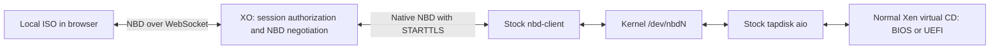

# Browser ISO spike: stock nbd-client on XCP-ng

## Result

The native NBD approach works on the XCP-ng 8.3 test host. A real browser File supplied the Debian 13.5 netinst ISO through XO's relay, stock `nbd-client` connected using verified TLS, and both BIOS and UEFI VMs booted the installer. The ISO is read on demand from the browser; it is not uploaded to XO, copied to Dom0, or placed on a network share. Closing the owning tab ends the media session.

This moves more protocol work into XO and reduces the host integration to a dedicated `browsernbd` SM driver, its registration, and existing system components. It is a feasibility spike, not a production storage feature.



## What changed in XO

`packages/xo-server/src/browser-media-nbd.mjs` adds a dedicated native NBD listener. It implements the small part of fixed-newstyle negotiation needed by the stock client: STARTTLS, export selection, INFO, GO, EXPORT_NAME, and ABORT. The browser keeps the previous spike's read-only NBD implementation. XO consumes its oldstyle greeting and supplies the equivalent native negotiation; after that it relays NBD requests and replies without interpreting disk operations. The protocol reference is the [upstream NBD specification](https://github.com/NetworkBlockDevice/nbd/blob/master/doc/proto.md).

`packages/xo-server/src/browser-media.mjs` reuses the existing browser session and paired-stream lifecycle for the new listener, adds the transport configuration, and stops native connections with the service. Sessions, negotiations, stream counts, option sizes, and buffering have bounds. Each host connection gets a separate browser data stream.

`packages/xo-server/src/api/browser-media.mjs` creates a shared ephemeral `browsernbd` SR when this mode is selected. The device configuration contains the XO host/port, expected ISO size, and a random export capability in the conventional `password` field. XAPI stores this as `password_secret`; the driver resolves it without putting the plaintext capability into normal SM request logs. The capability is a bearer credential, available to privileged host processes, and is sent to XO only after TLS negotiation by default.

The existing XO 5 and XO 6 local-ISO UI remains usable without another UI change. It retains tab ownership of the File, read-only media, insertion into running or halted VMs, and session cleanup. The native path was tested with an isolated browser harness and real XAPI operations, plus API regression tests; it was not retested through the user's running authenticated XO UI. The user's running XO installation was not switched to this branch.

## What changed on XCP-ng

`drivers/BrowserNbdSR.py` adds one SR driver. It loads the stock kernel NBD module, uses the installed `nbd_client_manager` allocation lock and free-device helper, and launches the installed `nbd-client` in read-only mode with certificate and hostname verification. It deliberately omits persistent reconnection. The actual export size is checked before normal SM activation.

The VDI attach operation returns `/dev/nbdN` through the ordinary SM attach result. Existing SM code then activates stock tapdisk with the `aio` backend and provides the normal guest CD path. No custom tapdisk NBD backend, direct-NBD dispatcher bypass, host WebSocket bridge, nbdkit build, xenopsd change, QEMU change, or xen-api source change is needed for this mode. On the live host, `tap-ctl list` showed `args=aio:/dev/nbd0`.

The driver records the allocated device, connection PID, and configuration fingerprint in root-only runtime state. Repeated attach reuses the matching connection. Detach runs after normal tapdisk teardown and disconnects the matching NBD device; it does not disconnect a device whose recorded connection PID has changed. This ownership check is a prototype safeguard, not a complete crash-recovery design.

The Makefile includes the driver in packaging. `scripts/prototypes/install-browser-nbd-client.py` installs just this driver and launcher and adds `browsernbd` to the host's configured SM plugin list. Initial discovery requires an XAPI restart. The script does not patch `SRCommand.py` or `blktap2.py`.

Earlier prototype implementations remain in the branch and on the test host for comparison. Their existing patches were not removed globally because other prototype media could still use them. The new driver has no `direct_nbd` flag and does not invoke those special paths. A final minimal host patch would contain only this driver, packaging/registration, and tests.

## What was tested

- Stock XCP-ng 8.3 `nbd-client` 3.24 connected to XO with TLS certificate verification, without installing a new NBD client or host bridge.
- The 791,674,880-byte ISO size matched. Four sampled 4 KiB blocks, including the beginning and end, matched SHA-256 hashes from the original local file.
- A temporary BIOS VM loaded the Debian installer kernel. The same temporary VM in UEFI mode reached the graphical installer language screen.
- Live CD eject, reinsertion, and hard reboot succeeded through normal XAPI operations. The device was reused through the driver lifecycle.
- The isolated browser was closed, then the temporary VM, VDI, SR, and PBD were removed. No test `nbd-client` processes, connected NBD devices, runtime records, or test tapdisks remained. The existing user VM stayed running. Automatic XAPI cleanup on browser loss was covered by the XO lifecycle tests rather than the independent live harness.
- XO regression tests cover verified TLS, plaintext rejection, unknown exports, independent connections, exact reads, end-of-file errors, INFO/EXPORT_NAME compatibility, browser disconnect, native SR configuration, and previous media lifecycle behavior.
- SM regression tests cover the new driver's TLS defaults, secret resolution, standard attach response, repeated attach, size mismatch rollback, changed configuration, and avoiding disconnection of a reused device, alongside existing ISO/dispatcher/tapdisk tests.

## Configuration

Use `XO_BROWSER_MEDIA_TRANSPORT=nbd-client` in the experimental XO build. Keep `XO_BROWSER_MEDIA_ORIGIN` set to an HTTPS origin whose hostname the hosts can resolve and reach. In this spike its hostname is also used as the native NBD destination.

```sh
XO_BROWSER_MEDIA_ORIGIN=https://xo.example
XO_BROWSER_MEDIA_TRANSPORT=nbd-client
XO_BROWSER_MEDIA_NBD_PORT=10809
XO_BROWSER_MEDIA_NBD_BIND=0.0.0.0
XO_BROWSER_MEDIA_NBD_TLS_KEY=/path/on/xo/nbd-key.pem
XO_BROWSER_MEDIA_NBD_TLS_CERT=/path/on/xo/nbd-cert.pem
# Optional: path on EACH XCP-ng host, not on XO:
XO_BROWSER_MEDIA_NBD_CA_FILE=/path/on/host/trusted-ca.pem
```

The browser uses XO's existing HTTP/WebSocket endpoint. Hosts connect outbound to XO's dedicated TCP port, which must be reachable separately from an ordinary HTTPS reverse proxy. The certificate must match the configured hostname or IP address; by default hosts use their system CA bundle. An explicitly configured private CA file is sufficient for a lab, as used in the live test. No global host CA trust was changed.

`XO_BROWSER_MEDIA_NBD_ALLOW_PLAINTEXT=1` disables the native TLS requirement only for explicit lab experiments. `XO_BROWSER_MEDIA_ALLOW_HTTP=1` is a separate switch for the browser HTTP origin. The successful native host test used verified TLS even though the isolated browser fixture used HTTP.

## Tradeoffs and remaining work

The host code is smaller and follows normal SM activation, but the data path gains a kernel NBD layer. TLS is handled by the stock client process; this is not a zero-copy or measured performance result. Throughput, CPU cost, concurrent boot storms, and failure latency remain unmeasured.

There is no one-ISO-per-pool restriction. Export capabilities select independent sessions on one XO listener, and each attached VDI on each host consumes an available NBD device. The spike loads the module with `nbds_max=24` when it is not already loaded; preexisting module configuration and other NBD consumers affect available capacity. The listener currently caps total connections at 64 and each session at eight data streams. Larger pools or heavier use need explicit sizing and admission behavior.

The driver reuses a private helper from `nbd_client_manager`; production integration should establish a supported allocation interface and verify compatibility across supported host releases. Runtime state, PID reuse, unexpected host/XO crashes, and recovery after failed teardown need further hardening. Session expiry closes streams, but a vanished browser is not an ISO that can be transparently reattached: the user must select it again.

PBD plug checks client availability; the remote export and size are checked at VDI attach. Therefore successful shared-SR creation alone does not prove network/TLS reachability from every host. This single-host experiment does not establish migration, pool-wide failover, or reconnect behavior. There is no full OS installation, performance benchmark, or production readiness claim.

For the stated goal of minimizing XCP-ng modifications, this is the most promising path tested so far: keep browser authorization, export selection, TLS service configuration, and relaying in XO, with a small host adapter into existing block-device storage machinery.
