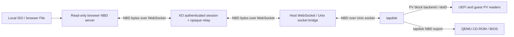

# Browser ISO streaming: NBD/WebSocket spike

## Result

The proposed topology works on the XCP-ng 8.3 test host. A real Chrome `File` served a local Debian 13.5 netinst ISO through NBD/WebSocket on both network legs. A temporary VM reached the BIOS installer boot menu and loaded the installer kernel; UEFI reached the graphical installer language-selection screen. Live eject/reinsert and a UEFI reboot succeeded. Closing Chrome revoked the export. The temporary VM and storage resources were removed after testing.

This is a feasibility spike, not a production storage backend. It extends the original HTTP Range spike; the original transport remains the default.



The host initiates an outbound WebSocket to XO. The browser also initiates its connections to XO. They need no direct connection to each other. XO can run on another machine, provided both can reach it. ISO bytes are read on demand; neither XO nor the host stores a complete ISO or requires an ISO share.

An ephemeral shared `browseriso` SR still provides the XAPI metadata for the medium. Shared here describes storage visibility, not persistent ISO storage. Every participating pool host needs the adapter and access to XO. Pool migration and multiple physical hosts were not exercised by this spike.

## Minimal changes relative to the HTTP spike

| Component                                                             | Change                                                                                                                                                                          |
| --------------------------------------------------------------------- | ------------------------------------------------------------------------------------------------------------------------------------------------------------------------------- |
| XO `packages/xo-common/browser-nbd.js`                                | Shared browser-only read-only NBD server; reads `File.slice()` in chunks. CommonJS entry works with both UI bundlers; TypeScript declarations accompany it.                     |
| XO 5 `packages/xo-web/src/common/local-iso.js`                        | Existing local-ISO control handles requests to open an NBD stream.                                                                                                              |
| XO 6 `@xen-orchestra/web/src/modules/vm/composables/browser-media.ts` | Same behavior through the shared implementation; existing VM Console panel is retained.                                                                                         |
| XO `packages/xo-server/src/browser-media.mjs`                         | Capability-protected relay pairs one host socket with one browser socket, forwards binary bytes, bounds buffering and pairing time, and closes streams with the tab session.    |
| XO `packages/xo-server/src/api/browser-media.mjs`                     | Selects the WebSocket URL and `transport=nbd-ws` in the shared SR device configuration. Existing admin authorization, CD insertion and cleanup stay in place.                   |
| SM `drivers/BrowserISOSR.py`                                          | Selects either the new bridge or existing nbdkit/curl adapter; validates NBD metadata on PBD plug. Stores the bridge capability in a root-only runtime file, removed on detach. |
| SM `drivers/browser_nbd_ws.py`                                        | Small Python bridge using websocket-client: binary WebSocket frames ↔ Unix socket bytes, without NBD translation or a kernel `/dev/nbd` device.                                 |
| SM Makefile and lab installer                                         | Include/install the bridge. Existing dispatcher and tapdisk type changes from the first spike are still required.                                                               |

No additional xen-api, QEMU, tapdisk C, or UEFI firmware modifications were needed. The tapdisk stage is retained because UEFI's PV CD access needs the vbd3 backend; exposing only a QEMU NBD socket was insufficient in the earlier spike.

## Connections and protocol choices

A tab-owned control WebSocket remains responsible for session readiness and opening data connections. Each host connection gets a separate browser NBD server, handshake, request queue and opaque cookies. Disconnecting one host connection does not invalidate the whole medium; closing the control connection does. The relay does not interpret NBD requests or convert them into HTTP reads.

The browser advertises a read-only, oldstyle NBD export compatible with tapdisk's existing client. QEMU continues using tapdisk's own NBD server. Requests may span WebSocket frames or share a frame; replies are serialized and file reads are chunked to 1 MiB. The implementation limits reads to 32 MiB, queues to 128 requests, and relay pairs to eight per medium. Write requests close the stream; invalid reads receive EINVAL. Reconnecting starts a new protocol session.

This follows the browser-as-NBD-server idea suggested by [jsnbd](https://github.com/openbmc/jsnbd). It does not embed jsnbd or its kernel NBD proxy. The deliberately small server uses the [NBD wire protocol](https://github.com/NetworkBlockDevice/nbd/blob/master/doc/proto.md). Oldstyle negotiation is a compatibility shortcut for this spike, not a proposal for a general-purpose modern NBD server.

## Trying the branch

Both repositories have a `feat/browser-nbd-websocket` branch. XO development and pushes use `olivierlambert/xen-orchestra-fork`; upstream pushes remain disabled.

Build the branch's xo-server and desired UI, then launch xo-server with:

```sh
XO_BROWSER_MEDIA_ORIGIN=https://xo.example \
XO_BROWSER_MEDIA_TRANSPORT=nbd-ws \
yarn workspace xo-server start
```

Keep the usual local start/configuration command if different. For the existing trusted lab configuration, use the host-reachable `http://192.168.1.30:8080` origin and also set `XO_BROWSER_MEDIA_ALLOW_HTTP=1`. This gives plain `ws` on the host leg. Secure deployments use `wss` with certificate verification. Reverse proxies must forward WebSocket upgrades under `/api/browser-media/`.

Install the SM branch and `websocket-client` on each host. The lab host has websocket-client 1.3.1 in `/opt/browser-media-prototype/python`, an isolated Python 3.6-compatible dependency, and the bridge under `/opt/xensource/sm/`. NBD mode does not use nbdkit. The old HTTP mode still needs nbdkit/curl. The lab installer accepts a driver with its sibling `browser_nbd_ws.py`.

Use the existing experimental local ISO control (XO 6: VM → Console). It still works while the VM is halted, as well as with an initialized CD drive on a running VM. Keep the source tab open. Set the transport to `http` or unset it to return to the original spike after disconnecting existing sessions.

## Validation and limits

- 23 XO transport/API tests passed, including both HTTP regression coverage and NBD fragmentation, coalescing, byte equality, independent streams, reconnect, EOF, write rejection, tab loss, and capability separation.
- 113 targeted SM tests passed, including transport validation, NBD probing and the existing ISO/dispatcher/tapdisk coverage.
- Changed JavaScript/TypeScript lint passed. A fresh dependency installation and dependency-aware build completed all 16 tasks, including xo-server, XO 5 and XO 6 production builds and the full XO 6 type-check. Initial failures caused by reusing an older checkout's dependencies were resolved.
- Real headless Chrome, a local ISO selected through its file input, the XO relay class, the host bridge, XAPI storage creation, tapdisk and the temporary guest were exercised together. The test harness used an isolated relay, not the user's running XO service. The full authenticated XO 5/6 UI flow was not repeated against the running server in this second spike.
- UEFI graphical installer loading and eject/reinsert/reboot were validated. No full OS installation, migration, throughput benchmark, WAN latency test, proxy/TLS deployment test or sustained resource-exhaustion test was performed.
- Existing spike limits remain: admin only, in-memory sessions, no automatic resume after tab/XO restart, and best-effort asynchronous XAPI cleanup.
- Before production, review the browser NBD implementation, dependency packaging, host WebSocket receive limits, idle connection health, proxy behavior and failure reporting. Standard NBD/TCP on the host leg remains an alternative; this branch implements only the WebSocket host leg.

The demonstrated simplification is removal of HTTP Range and nbdkit/curl from the NBD data path. The tradeoff is a browser NBD implementation and a host WebSocket bridge. XO retains authorization and session management while acting as an opaque relay for disk traffic.
